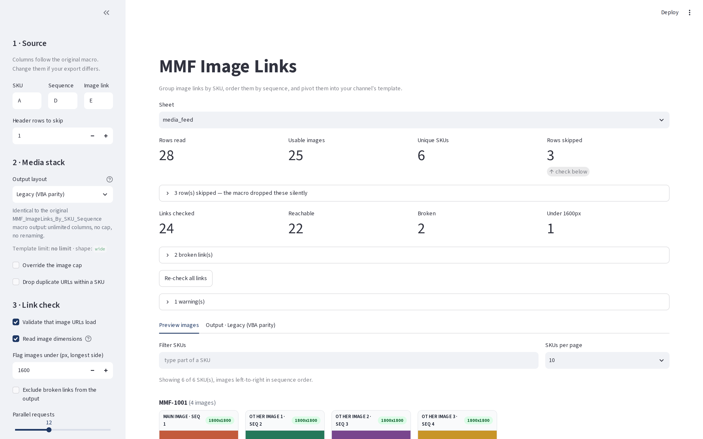
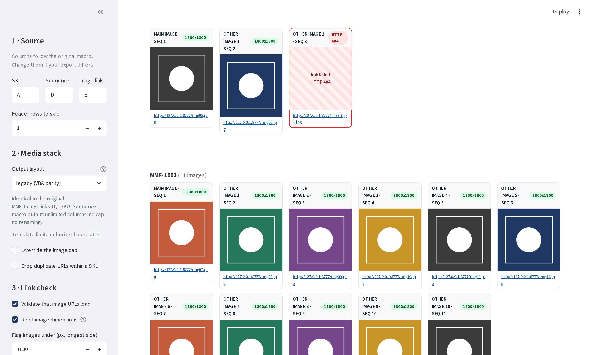

# MMF Image Links

Group product image links by SKU, order them by sequence, preview every image, and export them into your channel's template.

A Python/Streamlit port of the `MMF_ImageLinks_By_SKU_Sequence` Excel macro, with two additions the macro didn't have: **you see the images before you commit to the output**, and **you pick which media stack you're building for**.

> Original logic designed and developed by Yash Kende.



---

## What it does

Input is one row per image:

| A | B | C | D | E |
|---|---|---|---|---|
| **SKU** | Brand | Title | **Sequence** | **Image Link** |
| MMF-1001 | Northrig | Trail Runner | 3 | `https://.../c.jpg` |
| MMF-1001 | Northrig | Trail Runner | 1 | `https://.../a.jpg` |

Output is one row per SKU, images in sequence order:

| Master Id/ Sku | Main Image | Other Image 1 | Other Image 2 |
|---|---|---|---|
| MMF-1001 | `.../a.jpg` | `.../b.jpg` | `.../c.jpg` |

Same rules as the macro: a row needs a SKU, an image link, and a **numeric** sequence, or it's dropped. The difference is that dropped rows are now reported instead of vanishing.

## Quick start

```bash
git clone https://github.com/<you>/mmf-image-links.git
cd mmf-image-links
pip install -r requirements.txt
streamlit run app.py
```

Opens on <http://localhost:8501>. Drop in an export and go. There's a messy sample at `samples/sample_input.xlsx` if you want to see every code path fire.

## The two additions

### Image preview

Before you download anything, the **Preview images** tab shows every SKU's images as a grid, left to right in sequence order. Each tile is captioned with the slot it will land in (`main_image_url`, `PT01`, `Other Image 3`) and its sequence number, so a wrong main image is obvious at a glance rather than after upload.



Turn on **Validate that image URLs load** and each tile also gets a status badge:

| Badge | Meaning |
|---|---|
| `800x800` green | Loads, and here are its dimensions |
| `HTTP 404` red, hatched tile | Dead link |
| `not an image` amber | Loads, but it's HTML or a PDF — usually a login wall or an error page |
| `1200x1200 small` amber | Under your minimum longest side (defaults to 1600px, Amazon's floor) |

Checks run in parallel (12 at a time by default) and are cached, so changing stacks doesn't re-hit the network. **Exclude broken links from the output** drops dead URLs and shifts the remaining images up, so a broken image in position 1 doesn't leave you with an empty main image slot.

### Media stacks

The stack you pick controls output headers, how many images each SKU may carry, and the shape of the file:

| Stack | Shape | Columns | Cap |
|---|---|---|---|
| Legacy (VBA parity) | wide | `Master Id/ Sku`, `Main Image`, `Other Image N` | none |
| Amazon — flat file | wide | `item_sku`, `main_image_url`, `other_image_url1..8` | 9 |
| Amazon — PT naming | wide | `SKU`, `MAIN`, `PT01..PT08` | 9 |
| Walmart Marketplace | joined | `SKU`, `Main Image URL`, `Additional Image URL` (comma separated) | 9 |
| Shopify product CSV | **long** | `Handle`, `Image Src`, `Image Position` — one row per image | 250 |
| Target Plus | wide | `SKU`, `Primary Image URL`, `Alternate Image URL N` | 9 |
| eBay File Exchange | joined | `CustomLabel`, `PicURL` (pipe separated) | 24 |
| Generic flat | wide | `SKU`, `Image 1..N` | none |

When a SKU has more images than the cap allows, the extras are dropped **from the end** (highest sequence first) and listed in the audit sheet, so you always know what didn't make it.

## Adding or fixing a stack

Stacks are data, not code. Edit [`mmf_image_links/templates.yaml`](mmf_image_links/templates.yaml) — no Python required:

```yaml
  - key: my_channel
    label: "My Channel"
    description: "Whatever shows under the picker."
    shape: wide              # wide | joined | long
    sku_header: "Seller SKU"
    main_header: "Hero Image"
    other_header: "Gallery {n}"   # {n} = index among non-main images, {slot} = overall index
    max_images: 6
    on_overflow: truncate    # truncate = drop extras, warn = keep and flag
```

`"PT{n:02d}"` gives you `PT01`, `PT02`. The header names shipped here are best-effort — **check them against the template you actually upload** and correct the YAML if a channel has renamed something. That's the whole reason they live in a config file.

## Output file

The Excel download carries the pivoted sheet plus audit sheets you can hand back to whoever produced the feed:

- `output_image_links` — the actual output
- `skipped_rows` — rows rejected at parse time, with the reason
- `url_check` — status, content type, dimensions and size for every URL
- `warnings` — duplicate sequences, cap overflows

CSV download gives you just the output sheet, UTF-8 BOM so Excel opens it cleanly.

## Command line

Same logic, no browser — for batch runs or a CI step:

```bash
python -m mmf_image_links.cli --list-stacks

python -m mmf_image_links.cli feed.xlsx -s amazon_flatfile -o amazon.xlsx --validate

python -m mmf_image_links.cli feed.csv -s shopify -o shopify.csv \
    --dedupe --exclude-broken --cap 7
```

| Flag | Purpose |
|---|---|
| `-s, --stack` | Media stack key |
| `-o, --output` | `.xlsx` or `.csv`; omit for a summary only |
| `--sheet`, `--header-row` | Sheet name/index, and how many rows to skip |
| `--sku-col`, `--seq-col`, `--url-col` | Column letters (default `A`, `D`, `E`) |
| `--cap N` | Override the stack's image limit |
| `--dedupe` | Drop repeated URLs within a SKU |
| `--validate` | Check every URL resolves |
| `--exclude-broken` | Omit unreachable URLs from the output |

## As a library

```python
from mmf_image_links import core, get_stack

parsed, built = core.run("feed.xlsx", get_stack("amazon_flatfile"))

built.frame          # the pivoted DataFrame
built.grouped        # {sku: [ImageRow, ...]} in sequence order
built.warnings       # human-readable warnings
built.dropped        # images the stack couldn't carry
parsed.skipped       # rows rejected at parse time, with reasons
```

Nothing in `mmf_image_links/` imports Streamlit, so it drops into an existing pipeline as-is.

## Differences from the macro

The pivot is byte-for-byte compatible on the `vba_legacy` stack. Everything else is an addition:

| Macro | This |
|---|---|
| Rewrites the active workbook, deletes sheets | Reads a copy, writes a new file — your source is never touched |
| Bad rows disappear silently | Every skip is reported with a reason |
| No cap, no channel awareness | Per-stack caps and headers |
| No way to see the images | Preview grid with link validation |
| SKU sort is Excel's | Same ordering — numeric SKUs first and numerically (`9` before `10`), text case-insensitively (`A-1` before `b-1`) |
| Excel coerced `007` to `7` on the way through | `007` stays `007` |
| Duplicate sequences sort arbitrarily | Kept in file order, and flagged |
| `IsNumeric` rejects `nan` | So does this — `float("nan")` would otherwise parse, and a NaN sequence silently corrupts the sort |

Two things to know:

- If two rows share a SKU *and* a sequence, the macro's order between them was whatever Excel's sort happened to do. Here they stay in file order and you get a warning, because "which of these two is the main image" is a question only you can answer.
- VBA's `IsNumeric` is looser than Python's `float()` in places (`$5`, `(5)`, `&HFF` are all numeric to VBA) and tighter in others. This follows `float()`, minus `nan`/`inf`/`1_0`. If your sequence column contains currency-formatted or parenthesised numbers, they'll be reported as skipped rather than silently misread.

## Layout

```
app.py                      Streamlit UI
mmf_image_links/
├─ core.py                  parse, sort, group, pivot  (pure, no Streamlit)
├─ stacks.py                media stack loader
├─ templates.yaml           media stack definitions  <- edit this
├─ validate.py              concurrent URL health checks
├─ export.py                xlsx / csv writers
└─ cli.py                   headless runner
tests/test_core.py          27 tests covering the VBA parity rules
samples/make_sample.py      regenerates the messy sample workbook
```

## Tests

```bash
pip install pytest
pytest -q
```

## Deploying

The app holds no state between runs and writes nothing to disk, so any Streamlit host works — Streamlit Community Cloud (point it at `app.py`), an internal container, or `streamlit run` on a shared box. Image previews are rendered by the *viewer's* browser fetching the URLs directly, so anyone using it needs network access to wherever your images are hosted.

## Licence

MIT — see [LICENSE](LICENSE).
